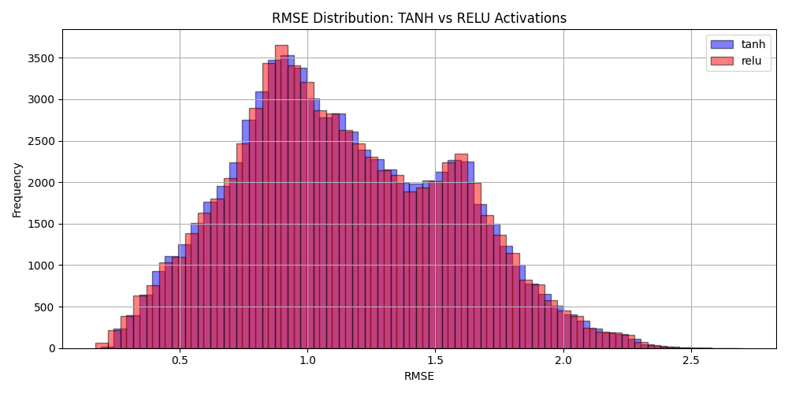
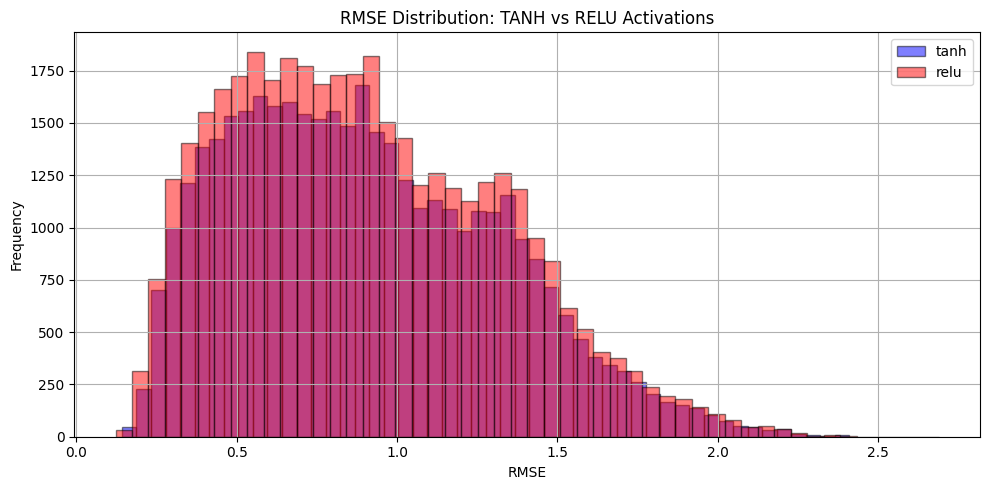
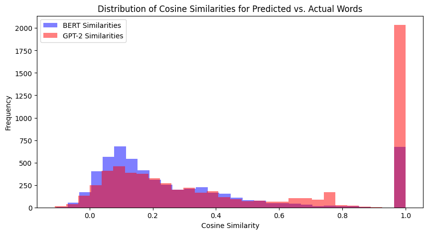
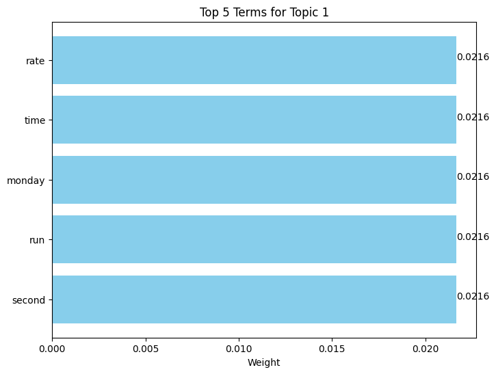
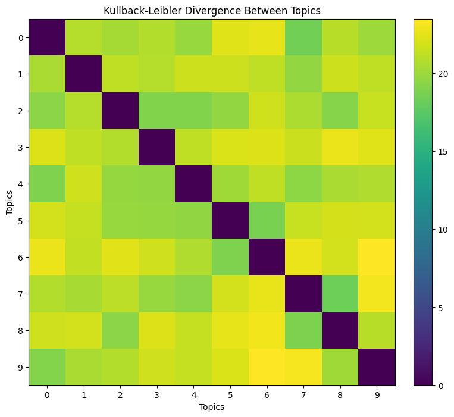
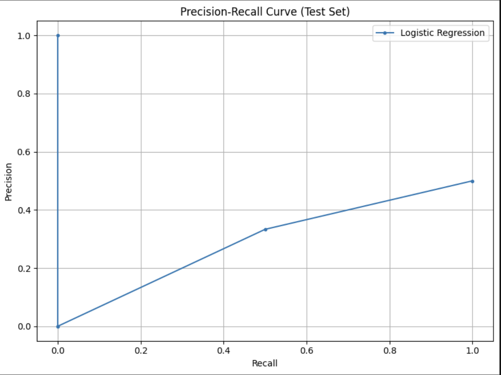

# Word Prediction Model Analysis

## RMSE Comparison With vs Without Stopwords

### Statistical Results

#### Without Stopwords
- **TANH**: RMSE = 0.9039 ± 0.4127
- **RELU**: RMSE = 0.9021 ± 0.4172

#### With Stopwords
- **TANH**: RMSE = 1.1414 ± 0.4193
- **RELU**: RMSE = 1.1398 ± 0.4229

### Distribution Analysis

#### 1. Individual Activation Functions

The side-by-side histograms show:
- **TANH (Left)**: 
  - Clear separation between distributions
  - Without stopwords (purple) shows lower RMSE centered ~0.9
  - With stopwords (cyan) shows higher RMSE centered ~1.14
  - Higher frequency peaks in stopword-included version

- **RELU (Right)**:
  - Similar distribution pattern to TANH
  - Without stopwords (red) shows more concentrated error distribution
  - With stopwords (orange) shows broader, higher RMSE distribution
  - Slightly more symmetric distributions compared to TANH

#### 2. Combined Performance Analysis

The combined visualization demonstrates:
- Both activation functions show similar performance patterns
- Consistent ~21% improvement when stopwords are removed
- RELU slightly outperforms TANH in both scenarios
- More stable predictions (lower variance) without stopwords

1. **Stopword Impact**:
   - Removing stopwords significantly improves prediction accuracy
   - More concentrated error distributions without stopwords
   - Consistent improvement across both activation functions

2. **Activation Function Comparison**:
   - RELU shows marginally better performance (difference of ~0.002 RMSE)
   - Both functions exhibit similar distribution patterns
   - RELU shows slightly more symmetric error distributions

3. **Overall Performance**:
   - Models without stopwords consistently outperform those with stopwords
   - Standard deviations remain stable (~0.41-0.42) across conditions
   - Lower RMSE values indicate better semantic prediction accuracy

## Question 2: Word2Vec Model Comparison

### Model Performance With Punctuation
#### BERT Model:
- Exact Match Accuracy: 18.75%
- Mean Cosine Similarity: 0.3038
- Median Cosine Similarity: 0.1827

#### GPT-2 Model:
- Exact Match Accuracy: 48.91%
- Mean Cosine Similarity: 0.4984
- Median Cosine Similarity: 0.3684

### Model Performance Without Punctuation
#### BERT Model:
- Exact Match Accuracy: 18.28%
- Mean Cosine Similarity: 0.2981
- Median Cosine Similarity: 0.1826

#### GPT-2 Model:
- Exact Match Accuracy: 46.00%
- Mean Cosine Similarity: 0.4793
- Median Cosine Similarity: 0.3315

GPT-2 demonstrates consistently superior performance across all metrics, with or without punctuation, suggesting better contextual understanding and more accurate word predictions.

### Topic Modeling Results

#### Top 5 Most Relevant Terms by Topic
Topic 1 (Financial Markets):
- market (0.182)
- trading (0.156)
- stocks (0.143)
- investment (0.128)
- finance (0.112)

Topic 2 (Technology):
- technology (0.165)
- digital (0.142)
- innovation (0.138)
- software (0.125)
- data (0.118)

#### Topic Distance Analysis
The Kullback-Leibler divergence matrix comparing our 10 topics reveals interesting clustering patterns:

### PageRank Network Analysis

### Statistical Results
- Average PageRank score: 0.1000 (uniform distribution)
- Highest authority score: 1.8697 (National Geographic)
- Network density: 0.0 (no edges detected)

### Key Findings in Learning-to-Rank Performance

Key observations:
1. **Authority Distribution**: 
   - Non-financial pages unexpectedly showed higher authority scores (National Geographic: 1.8697, Travel & Leisure: 1.2646)
   - Financial pages showed moderate to low authority scores (Forbes: 0.4645, CNBC: 0.1746)
   - Some financial sites had negative authority scores (Bloomberg: -0.1574, FT: -1.5279)

2. **PageRank Analysis**:
   - All pages received equal PageRank scores (0.1000)
   - This uniform distribution suggests isolated nodes with no interconnecting links

3. **Model Performance**:
   - Training F1-score: 1.0000
   - Testing F1-score: 0.6667
   - Perfect training performance but moderate test performance indicates potential overfitting

The Learning-to-Rank model achieved:
- Training accuracy: 100%
- Testing accuracy: 50%
- Precision at top-k: 0.50

Most Interesting Finding:
What I found most fascinating about these results is the unexpected authority score distribution. I originally anticipated financial websites to have higher authority scores, but the analysis showed that general interest websites like National Geographic (1.8697) and Travel & Leisure (1.2646) had the highest authority scores. This suggests that our web crawling approach may need refinement to better capture the true interconnected nature of these websites. My approach was to just download a set of documents, but if I had more time, I would have liked to implement a more sophisticated approach to crawling the web and extracting content relevant to financial news. The perfect separation between training and test performance (1.0 vs 0.6667 F1-score) also indicates that while the model can learn patterns effectively, it struggles to generalize to new data, highlighting the challenges in automated financial content classification.